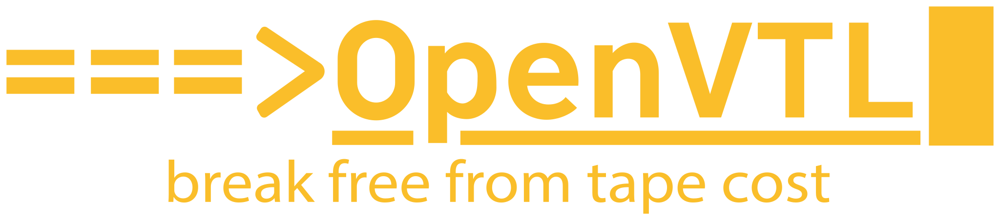

<p align="center">
  <br>
  
</p>

<p align="center">
  <strong>The open virtual tape library for IBM i.</strong><br>
  A Fibre Channel appliance that presents a bit-faithful IBM TS3100/TS3200 or TS3500
  to the host — so BRMS, SAV/RST, and every tape workflow you already have keep
  working, and never learn the tape isn't real.
</p>

<p align="center">
  <a href="https://github.com/OpenVTL/OpenVTL/releases/latest"></a>
  <a href="LICENSE"></a>
  
  
  <a href="https://docs.openvtl.com"></a>
</p>

<p align="center">
  <a href="https://openvtl.com">Website</a> ·
  <a href="https://openvtl.com/downloads">Downloads</a> ·
  <a href="https://docs.openvtl.com">Operator guide</a> ·
  <a href="https://openvtl.com/calculator">Sizing calculator</a> ·
  <a href="https://openvtl.com/quote">Enterprise support</a>
</p>

---

## What it is

OpenVTL replaces physical tape libraries and legacy VTLs for IBM i shops. One
Debian VM with a QLogic HBA in target mode becomes an IBM **TS3100/TS3200
(3573)** or **TS3500 (3584)** on your fabric, with LTO drives, real barcoded
cartridges, and the exact INQUIRY/VPD identity, element addressing, and sense
data the IBM i expects. Tape data lands on **ZFS** with zstd compression and
global block deduplication. Vaulted media tiers to any **S3-compatible** object
store, and an entire library can be rebuilt from the bucket alone.

Everything is managed by a single Go daemon — `openvtld` — with an embedded
web UI. All free software. No phone-home. Operator-maintainable.

## Why BRMS never notices

The data path is a pSCSI passthrough: LIO hands the host mhVTL's own device
identity (vendor, product, serial, NAA) unchanged, so the library and drives
look identical across reboots, rebuilds, and appliance upgrades. No
re-enrollment, ever.

**The data path is frozen; the control plane only observes and orchestrates.**
A stopped `openvtld` never interrupts a running backup.

## Status — v1.0.0

Save/restore, labels, EOV/multi-volume, both library models, and BRMS behavior
are **field-validated against IBM i over 8 Gb FC**. Emulated identities are
held to the IBM SCSI references at the wire level (INQUIRY/VPD, element
status, sense data). OpenVTL is **FC-only by design** — see
[docs/why-fc-only.md](docs/why-fc-only.md).

## Features

**Library and storage**
- Libraries, drives, and cartridges created and managed from the web UI — live
  library grid, drive activity, jobs, and an event journal.
- ZFS storage plane: zstd by default, global dedup with the dedup table on a
  dedicated SSD vdev, dedupe granularity scaled from RAM at pool creation,
  online pool growth.

**Offsite and recovery**
- S3 export/import with a generation-keyed layout and resumable chunked
  uploads; eviction as the pool's pressure valve.
- One-click whole-library disaster recovery from the bucket, cartridge labels
  preserved.

**Access and operations**
- Hard-deny initiator ACLs with per-port and per-library scoping.
- Authentication, roles, and a full audit trail. Prometheus metrics.
- **Ed25519-signed release bundles** — `openvtld update` / `rollback` /
  `verify-bundle`, an Updates panel in the UI, and an automatic rollback
  watchdog if a new binary fails health checks.
- Redacted support bundles and a board-fingerprint support key that survives
  HBA swaps.

## Architecture

```
IBM i / BRMS ── Fibre Channel (tcm_qla2xxx target mode)
  └─ LIO (pSCSI backstores — identity passthrough)
       └─ mhVTL (patched: 3573-TL / 03584L32 personalities, LTO drives)
            └─ tape image files on ZFS (zstd + dedup, dedup table on SSD)
                 └─ vaulted media → S3-compatible object store

openvtld (Go, single static binary, SQLite state, embedded React UI):
  inventory · library/pool lifecycle · FC boot orchestration · jobs ·
  S3 export/import/DR · ACLs · auth/audit · metrics · signed updates
```

## Requirements

| | |
|---|---|
| **OS** | Debian 13 (trixie). RHEL-family kernels disable FC target mode; Debian ships the whole stack natively. mhVTL and ZFS kernel modules are managed via DKMS. |
| **HBA** | QLogic Fibre Channel (25xx/26xx) supported by the `qla2xxx` driver, in target mode. The installer requires the `firmware-qlogic` package. |
| **Boot** | Secure Boot off, or MOK-enrolled module signing — see [packaging/dkms/README.md](packaging/dkms/README.md). |
| **Memory** | ≥ 24 GiB unlocks 16K dedupe granularity at pool creation. Size with the [calculator](https://openvtl.com/calculator); compression (~1.4×) is the reliable floor, dedup pays across retained generations. |
| **Disks** | A dedicated SSD for the dedup table, plus data disks for the pool. |
| **Virtual** | See [docs/reference-vm-spec.md](docs/reference-vm-spec.md), and for Proxmox HBA passthrough, [docs/proxmox/qlogic-vfio-passthrough.md](docs/proxmox/qlogic-vfio-passthrough.md). |

**Deployment assumptions.** The openvtld management UI and API are designed to
run on an isolated management network; they are not hardened for exposure to
untrusted networks or the internet. Network-level access control, and any
authentication hardening beyond the built-in session auth, are the operator's
responsibility.

## Install

1. Download the current release bundle from
   [openvtl.com/downloads](https://openvtl.com/downloads). Every bundle carries
   `SHA256SUMS` and a detached Ed25519 signature; the installer and updater
   verify it against the public key committed in this repo, and the downloads
   page publishes that key out of band so you can verify before the installer
   ever runs.
2. Unpack on the appliance and run the idempotent installer:

   ```bash
   sudo openvtl-<version>/repo/packaging/install.sh
   ```

3. Log in at `https://<host>:8443` and complete first-run setup: create the
   admin account, build storage, create a library.

The first-time operator guide at [docs.openvtl.com](https://docs.openvtl.com)
walks the full path from a blank VM to a completed IBM i save. Day-2
operations — boot chain, FC fabric recovery, storage, offsite/DR, updates —
live in the [operator runbook](docs/operator-runbook.md).

## Repo layout

| Path | Purpose |
|---|---|
| `openvtld/` | The daemon (Go) and embedded web UI (React/Vite) |
| `packaging/install.sh` | The installer — idempotent phases: prep / mhvtl / openvtld / verify |
| `packaging/mhvtl/` | mhVTL emulation patches and drive identity |
| `packaging/dkms/` | mhVTL kernel-module DKMS packaging |
| `packaging/systemd/` | `openvtld.service`, update watchdog, data-plane drop-ins |
| `third_party/` | Vendored, pinned mhVTL source (GPL-2.0) |
| `scripts/make-release.sh` | Cut a signed release bundle |
| `docs/` | Operator runbook, VM spec, Proxmox passthrough guide, why-FC-only |
| `tests/` | DKMS kernel-update survival gate |
| `NOTICE` | Copyright, license, and trademark summary for the whole tree |

## Building from source

```bash
cd openvtld/web && npm ci && npm run build
```

```bash
cd openvtld && GOOS=linux GOARCH=amd64 CGO_ENABLED=0 go build ./cmd/openvtld
```

Release bundles are cut with `scripts/make-release.sh` (builds UI + binary,
stages the repo, writes `SHA256SUMS`, signs it). Signing is mandatory —
unsigned bundles are refused at install and update time.

## Support

Enterprise support is available by quotation — [request a quote](https://openvtl.com/quote).
Community discussion and bug reports go through this repository's issue
tracker. **Security reports go to [security@openvtl.com](mailto:security@openvtl.com), never public issues** — see [SECURITY.md](SECURITY.md).

## Contributing

Outside contributions require a signed [CLA](CLA.md); the process is in
[CONTRIBUTING.md](CONTRIBUTING.md). The data path (mhVTL patches, LIO layout,
SCSI identity) is frozen — changes there need a validated IBM i run, not just
a green build.

## License

Copyright © 2026 Emerald Coast Technologies LLC, d/b/a OpenVTL.

OpenVTL's original code (daemon, web UI, packaging, documentation) is licensed
under the **AGPL-3.0** ([LICENSE](LICENSE)), with an additional trademark term
under AGPL §7(e) — see [TRADEMARK.md](TRADEMARK.md). The mhVTL emulation
patches are derivative works of mhVTL and are **GPL-2.0**; vendored mhVTL keeps
its own license. See [NOTICE](NOTICE) for the one-page summary and
[THIRD_PARTY_NOTICES.md](THIRD_PARTY_NOTICES.md) for everything statically
linked into the shipped binary.

"OpenVTL"™ and the OpenVTL logo are trademarks of Emerald Coast Technologies
LLC. Registration pending.
